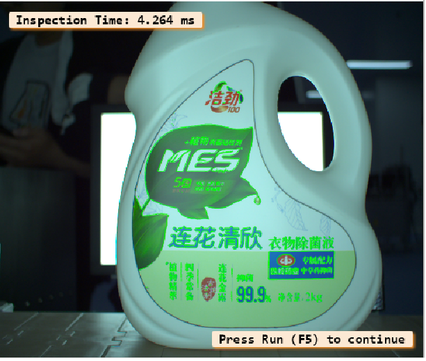
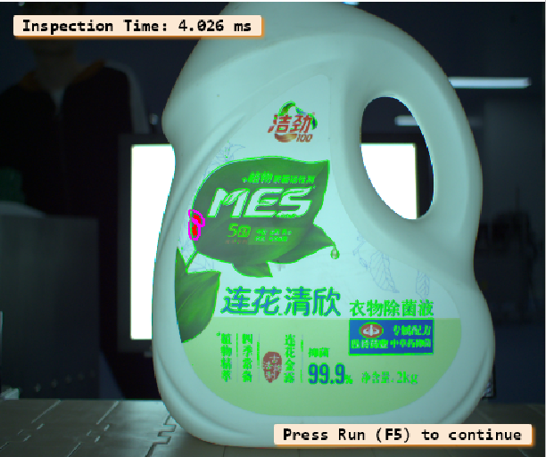

# Laundry Bottle Label Defect Inspection

HALCON / HDevelop coursework project for locating a bottle label and inspecting its printed surface with shape matching and a variation model.

## Overview

The latest project script in this folder is `16-gen_label_templates(test).hdev` (modified 2024-06-22). It builds bottle and label shape models, prepares a variation model from a reference image, then aligns inspection images and displays detected difference regions.

Earlier experiments are preserved under [`代码/`](代码/). They include alternative segmentation and inspection approaches; the root script is the newest dated source file and is the recommended starting point.

### Source versions

- `代码/16-gen_label_templates(new).hdev` (2024-06-20) uses Canny edges directly in the bottle region, selects contours of length 200–500, and uses a narrower 0.9–1.1 scale range with local polarity. Its inspection loop has no median filter or per-image error handler.
- `代码/16-gen_label_templates(test).hdev` (2024-06-22, earlier that day) adds the variation-model training pass, median filtering, and error handling.
- The root `16-gen_label_templates(test).hdev` (2024-06-22, latest) changes bottle-region extraction to local mean-based thresholding, broadens contour and scale ranges, ignores local polarity, and retains the filtering and error handling. It is the recommended entry point.

These are successive experiments, not required modules. Run the root `test` script for the latest version; keep the earlier scripts only as development history.

## Requirements

- HALCON / HDevelop 22.05 or a compatible version. The source file declares HALCON 22.05.
- The authorized `Cam1_01.bmp` through `Cam1_20.bmp` input images, placed beside the HDevelop script.

The 20 `Cam1_*.bmp` input images are included. The personal coursework report remains excluded because it contains personal identifiers. Selected, non-identifying result images from the report are included below.

## Usage

1. Open `16-gen_label_templates(test).hdev` in HDevelop.
2. Set HDevelop's working directory to the repository root.
3. Keep the included `Cam1_*.bmp` files beside the script.
4. Run the script. It writes `bottle_body.shm`, `region.hobj`, `label_back.shm`, and `label_back.vam` to the working directory and inspects the first eight numbered images in its loop.

The generated HALCON files are local build artifacts and are ignored by Git. The script includes interactive `stop()` calls between inspected images.

## Method

- Extracts contours and creates a scaled shape model for bottle localization.
- Builds an eroded label region and a second shape model for label matching.
- Uses a direct variation model to identify print differences after alignment.
- Filters and visualizes candidate defect regions.

## Results

The coursework report describes qualitative results for the first eight images: `Cam1_01` and `Cam1_03` are labeled defect-free, while the other six images are labeled as defect detections. The examples below are selected from the original report figures and retain the HALCON inspection overlays.

**Cam1_01 — no defect reported**



**Cam1_04 — defect highlighted**



These are qualitative coursework outputs, not an independently verified accuracy evaluation. The displayed inspection times come from the original screenshots and should not be treated as benchmark measurements.

## Project structure

```text
.
├── 16-gen_label_templates(test).hdev  # Latest dated source
├── 代码/                              # Earlier HDevelop experiments and generated files
├── figures/                           # Selected inspection result screenshots
└── Cam1_*.bmp                         # Input image sequence
```

## Verification and limitations

The HDevelop application was not available for execution during repository cleanup, so runtime behavior and inspection accuracy have not been independently verified. The input images are included, and the report screenshots provide qualitative examples only; no quantitative accuracy claim is made.

## Course context

Undergraduate course design project for **Machine Vision and Machine Learning (Bilingual Course)**. The original coursework report is intentionally excluded from the public repository because it contains personal identifiers. Selected recognition result images and descriptions are included separately.
